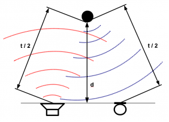
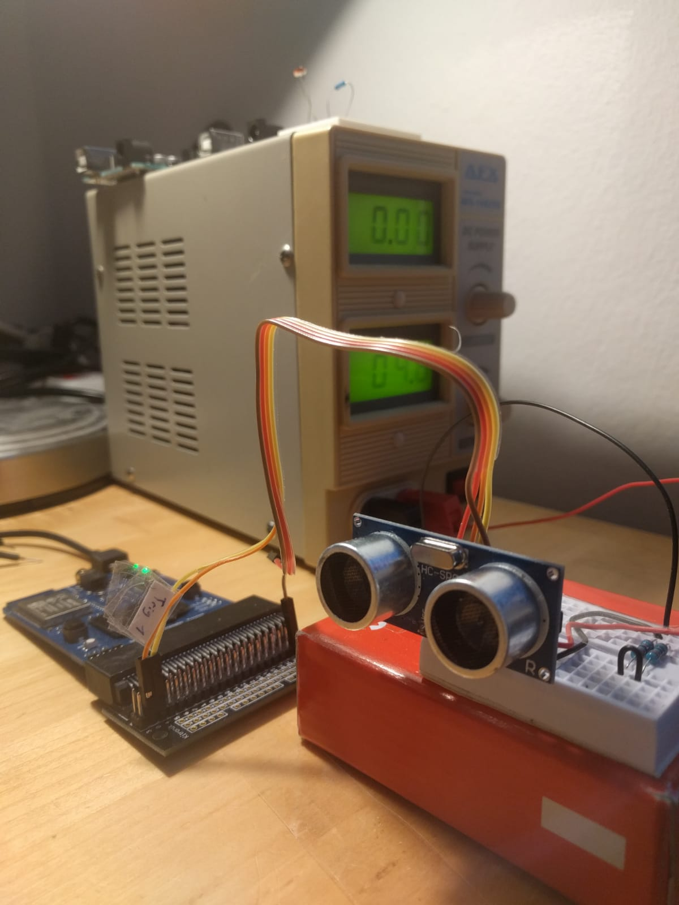
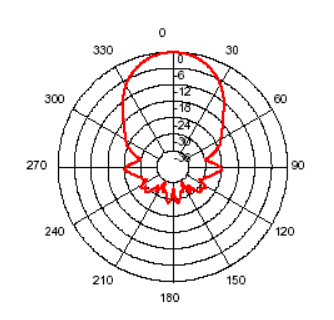
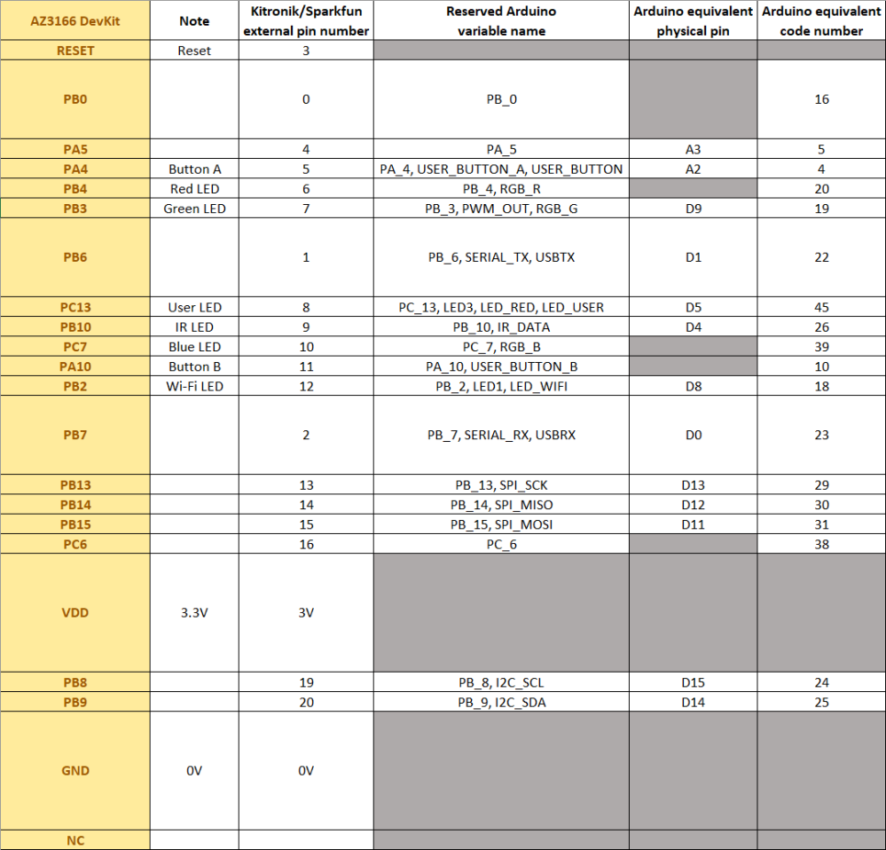
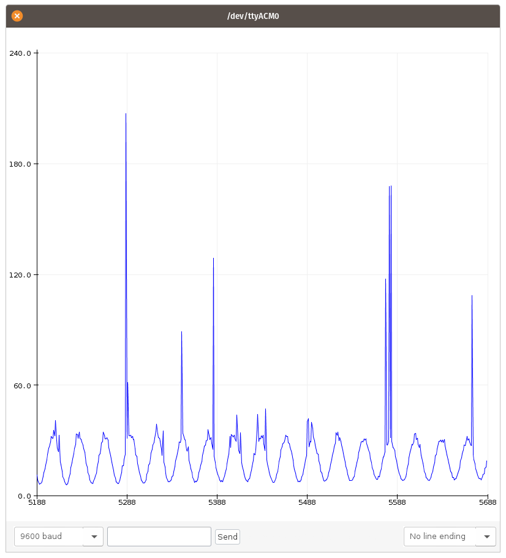
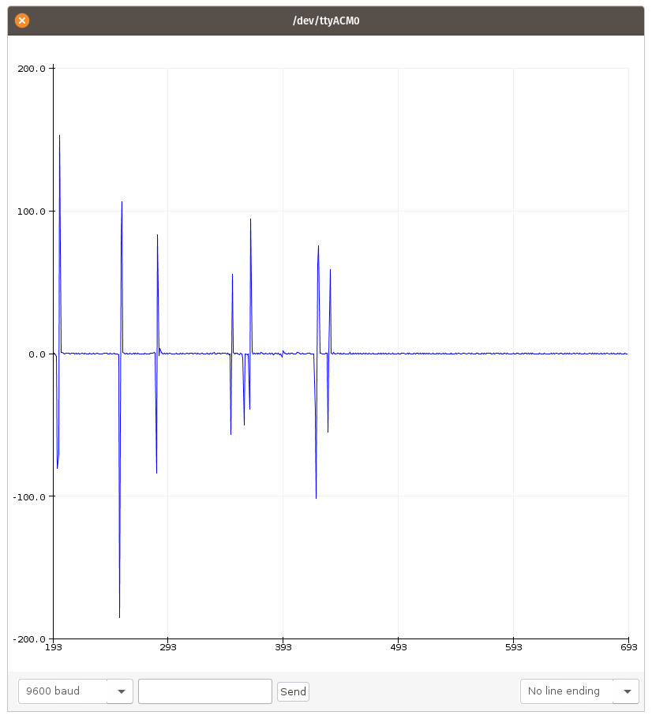

<!--

author:   Sebastian Zug & André Dietrich & Galina Rudolf
email:    sebastian.zug@informatik.tu-freiberg.de & andre.dietrich@ovgu.de & Galina.Rudolf@informatik.tu-freiberg.de
version:  1.0.2
language: de
narrator: Deutsch Female

comment: Einführung in die Programmierung für Nicht-Informatiker
logo: ./img/LogoCodeExample.png

import: https://github.com/liascript/CodeRunner
        https://github.com/LiaTemplates/AVR8js/main/README.md#10
        https://raw.githubusercontent.com/liascript-templates/plantUML/master/README.md

-->

# Anwendungsentwicklung und Beispiele

Die interaktive Version des Kurses ist unter diesem [Link](https://liascript.github.io/course/?https://raw.githubusercontent.com/SebastianZug/VL_ProzeduraleProgrammierung/master/14_Arduino_Applikation.md#1) zu finden.

**Wie weit waren wir gekommen?**

* Einführung in C
* Konzepte der Objektorientierten Programmierung mit C++
* Einführung in die Arduino-Welt

**Inhalt der heutigen Veranstaltung**

* Aspekte der Umsetzung eines Projektes
* Wiederholung der Inhalte

**Fragen an die heutige Veranstaltung ...**

* Warum ist der Schritt von einem Programm in eine reale Anwendung so herausfordernd?

## Korrektur der Darstellung aus der letzten Vorlesung

In der vergangenen Vorlesung wurde ich von einem Ihrer Kommilitonen darauf hingewiesen, dass die Buttons im Unterschied zu meinen Erklärmustern bezüglich der Interrupts, im "ungedrückten" Zustand einen High-Pegel zeigen. Das ist natürlich richtig.

```
void setup() {
  Serial.begin(9600);
  pinMode(USER_BUTTON_A, INPUT);
}

void loop() {
  Serial.println(digitalRead(USER_BUTTON_A));
  delay(100);
}
```

## Allgemeines Vorgehen für die Realisierung einer Anwendung

1. Technische Beschreibung der konkrete Messaufgabe

    + Wie lange und häufig, soll was mit welcher Genauigkeit erfasst werden?
    + Welche störenden Umgebungsbedingungen sind zu berücksichtigen?
    + Wie soll die Datenübertragung erfolgen?
    + Soll die Datenerfassung "überwacht" erfolgen?

2. Auswahl eines geeigneten Sensorsystems

3. Auswahl / Entwurf eines Mikrocontrollerboards

4. Aufbau und Programmierung eines Prototyps

5. Testen, testen, testen

6. Auslieferung und Wartung

> Das Board, dass wir im Rahmen dieser Veranstaltung kennen gelernt haben, ist
nur ein Beispiel. Für ein konkretes Vorhaben sollten Sie die geeignetste Plattform
auswählen.

## Anwendungsbeispiel Ultraschallsensor

> **Aufgabe** "Entwickeln Sie einen Sensor, mit dem wir die Periodizität eines Pendels vermessen können."

Wir hatten diese Aufgabe bereits in der Vergangenheit gelöst und dafür den Magnetsensor unseres Boardes verwendet. Nun wollen wir ein alternatives Messkonzept implementieren.

Was könnten Gründe dafür sein?

+ die magnetische Messung musste in einem schmalen Korridor unter dem Pendel stattfinden.
+ das Pendel selbst musste aus einem magnetoresistiven Material bestehen.
+ in der Umgebung durften keine aktiven oder passiven Störfelder für das Magnetfeld (Lautsprecher, Heizkörper) existieren.

### Technische Beschreibung des Problems

Ein ein Meter langes Pendel vollführt eine Periode seiner Bewegung in etwa einer Sekunde (vgl. [Link](https://rechneronline.de/rad/pendel.php)). Wir wollen diese Bewegung erfassen, um die Pendellänge zu bestimmen.

$$
T_0= 2\pi\sqrt{\frac{l}{g}}
$$

Dabei zeigen sich folgende Unwägbarkeiten:

+ die Erdbeschleunigung ist ortsabhängig und nur mit einer bestimmten Genauigkeit bekannt.
+ bedingt durch die geringe Größe unseres "Home Office" Labors haben wir nur eine Pendellänge von 50cm. Das bedeutet, unsere Periodendauer ist etwa 1.4s lang.
+ die Beleuchtungssituation ist problematisch.

> **Merke:** Machen Sie sich auch über die Referenzmessung für Ihr System Gedanken! In unserem Fall ist dies ein hochauflösenden Lineal :-)

### Auswahl eines Sensors

Wir entscheiden uns für ein Distanzbasiertes Verfahren, überwachen also die Entfernung des Pendelkörpers zur Position eines Sensors. Ein einfaches und kostengünstiges Messverfahren dafür sind Ultraschallsensoren. Alternativ wären auch Laser oder Bildbasierte Verfahren denkbar.

... Was war das noch mal, "Schallgeschwindigkeit"

<!--style="width: 50%; max-width: 640px;"-->
[^1]

[^1]: roboticlab.eu "Funktionsweise eines Ultraschall-Entfernungsmessers."

Für eine gleichförmige Bewegung können wir den Weg als Produkt aus dem Messintervall und der halben Laufzeit abbilden.

$$s = v_{Schall} \cdot \frac{t}{2}$$

Leider gibt es ein Problem, die Schallgeschwindigkeit ist nicht konstant!
Neben den Reflexionsmechanismen sind auch die Ausbreitungsparameter des Schallimpulses von der Umgebung abhängig.
Die Schallgeschwindigkeit ist abhänig von

+ Temperatur
+ Luftdruck
+ Luftzusammensetzung (Anteil von CO$_2$, Luftfeuchte)

<!--style="width: 70%; max-width: 720px;"-->

Annäherungsweise gilt aber die Formel

$$v_{Schall} (m/s) = 331.3 + (0.606 × T) $$

### Aufbau und Programmierung eines Prototyps

Für die Umsetzung wählen wir einen SRF04 Distanzsensor.

+ Bereiche von 3cm bis 3m
+ Öffnungswinkel etwa 50 Grad
+ Gibt ein positives TTL-Pegelsignal aus, Breite proportional zur Reichweite
+ 3-4cm Auflösung
+ Abmessungen: 43mm x 20mm x 17mm

<!--style="width: 50%; max-width: 500px;"-->

Diagramm des Erfassungsbereiches mit Angabe der Winkellage und der Dämpfung des Signals.

<!--style="width: 50%; max-width: 500px;"--> [^1]

[^1]: Produktdokumentation des Herstellers Devantech, zum Beispiel unter [Link](https://www.robotshop.com/media/files/pdf/devantech-ultrasonic-range-finder-specifications.pdf)

Verlauf eines Messvorganges

<!--style="width: 70%; max-width: 720px;"-->

[^1]: Produktdokumentation des Herstellers Devantech, zum Beispiel unter [Link](https://www.robotshop.com/media/files/pdf/devantech-ultrasonic-range-finder-specifications.pdf)

Lassen Sie uns also zunächst den Sensor untersuchen und eine Verarbeitungskette entwerfen.

Nun muss unser Sensor mit dem Controller verbunden werden.
Bei den ersten Projekten sorgt die Zuordnung der Verdrahtung der Komponenten für Verwirrung. Es existieren nämlich verschiedene Bezeichner für die zugehörigen Pins:

+ Angabe des Controllerherstellers für den eigentlichen Chip
+ Angabe des Boardherstellers für die Kontaktpunkte
+ Angabe des Steckerherstellers

Glücklicherweise hat [Jemermy Lindsay](https://jeremylindsayni.wordpress.com/2017/11/11/using-the-mxchip-az3166-azure-devkit-with-arduino-coding-with-pin-names-instead-of-numbers/) diese Angaben für unseren Controller in einer sehr anschaulichen Tabelle aufgeführt. Vielen Dank dafür!

<!--style="width: 70%; max-width: 800px;"-->

```c     UltraSonic.c
const int trigPin = 6;
const int echoPin = 7;

long int start = 0;

void setup() {
  pinMode(trigPin, OUTPUT);
  pinMode(echoPin, INPUT);
  Serial.begin(9600);
  digitalWrite(trigPin, LOW);
}

void loop() {
  digitalWrite(trigPin, HIGH);
  delayMicroseconds(10);
  digitalWrite(trigPin, LOW);

  //Lösung aus der Literatur für den Arduino UNO, MEGA usw
  //Diese Funktion ist für unseren MXChip nicht implementiert
  //duration = pulseIn(echoPin, HIGH);
  //Serial.println(duration);

  while(digitalRead(echoPin) == LOW);
  start = micros();
  while(digitalRead(echoPin) == HIGH);
  Serial.println(micros()-start);   // <- Bestimmung der Zeitdifferenz

  delay(10);
}
```

<!--style="width: 50%; max-width: 800px;"-->

Welche Kritikpunkte hat die Lösung:

+ Die Messdauer ist von der Entfernung abhängig! Es werden etwa
+ Der Signalverlauf ist mit einem Rauschen (30$\mu ==s$ entsprechend 0.5cm Distanz) überlagert.
+ Zwischenzeitlich sind Ausreißer im Verlauf möglich.

Für die Entfernungsbestimmung integrieren wir eine entsprechende Funktion:

```c
float calcDist(long duration, float temp){
  float us_speed = (331.3 + (0.606 * temp)) / 1000 / 1000 * 100;
  return us_speed*duration / 2;
}
```

Für die Temperaturkalibrierung führen wir eine entsprechende Messung mit dem Onboard-Temperatursensor durch.

```c
#include "HTS221Sensor.h"

DevI2C ext_i2c(D14,D15);
HTS221Sensor sensor(ext_i2c);
float temperature = 0;

void setup() {
  ...
  sensor.init(NULL);
  sensor.enable();
}

void loop() {

  sensor.getTemperature(&temperature);
  ...
}
```

### Testen

Mit dem Einbringen unseres Sensors in den Messaufbau zeigen sich im Signalverhalten allerdings neue Herausforderungen. Offenbar stören Ausreißer den Signalverlauf.

<!--style="width: 50%; max-width: 800px;"-->


**Lösungsansatz 1: Fehleridentifikation**

Die Detektion zielt auf die Erfassung von Anomalien im Signalverlauf. Dabei werden Modelle des Signalverlaufes oder der Störung genutzt, um

* Ausreißer (single sample)
* Level shifts (mehrere aufeinander folgende Samples)
* veränderliches Noiseverhalten
* ...

Wie können wir offenkundig fehlerhafte Werte erkennen?

Lassen Sie uns zwei aufeinanderfolgende Werte vergleichen, wenn wir unser Messobjekt nur leicht verdrehen.

```
void loop() {

  distance = calcDist(micros()-start, temperature);
  if (abs(oldDistance - distance) < MAGICLIMIT) valid = 50;
  else valid = 0;

  oldDistance = distance;

}

```

Wie aber legen wir den Schwellwert `MAGICLIMIT`

<!--style="width: 50%; max-width: 800px;"-->


**Lösungsansatz 2: Filterung zur Fehlereliminierung**

Zielstellung

+ Reduzierung des Rauschens
+ Löschung von fehlerhaften Werten
+ Konzentration der Daten

Ein Filter bildet die Folge $x_i$ der Sensorwerte auf eine Folge $y_i$ ab. Die Domäne, in der der Filter arbeitet, kann im Zeit oder Frequenzbereich liegen. Als Vorwissen auf Seiten des Entwicklers kann die Signalspezifikation oder ein Systemmodell angenommen werden.

Ein Ansatz für die Glättung sind gleitende Fenster, innerhalb derer die Daten in Relation gesetzt werden.

> Anders als in (offline) Zeitreihen-Analysen leiten wir den Ausgabewert ausschließlich von den zuvor erfassten Werten ab.  

$$y_k(x_k, x_{k-1}, x_{k-2} ... x_{k-N+1})$$ mit $N$ als Fenstergröße

Zeitreihen würden auch die nachfolgenden Werte berücksichtigen!

$$y_k( ... x_{k+2}, x_{k+1}, x_k, x_{k-1}, x_{k-2} ...)$$

Damit laufen wir den Messdaten zeitlich gesehen hinterher!

Ein gleitender Mittelwert wird häufig als Allheilmittel für die Filterung von Messwerten dargestellt, manipuliert das Signal aber auch entsprechend:

$$y_k = \frac{1}{N}\sum_{i=0}^{i<N} x_{k-i}$$

Und auf dem Controller?

```c
#define WINDOW_SIZE 8

int index = 0;
int value = 0;
int sum = 0;
int samples[WINDOW_SIZE];
float mean = 0;

void setup() {
   ....
}

void loop() {

  sum = sum - samples[index];       // Remove the oldest entry from the sum
  value = analogRead(IN_PIN);       // Read the next sensor value
  samples[INDEX] = value;           // Add the newest reading to the window
  sum = sum + value;                // Add the newest reading to the sum
  index = (index+1) % WINDOW_SIZE;  // Increment the index, and wrap to 0 if it exceeds the window size

  mean = sum / WINDOW_SIZE;         // Divide the sum of the window by the window size for the result

  ...

  delay(25);
}
```

<!--style="width: 50%; max-width: 800px;"-->


> **Frage:** Welche Wirkung hat die Vergrößerung des Fensters?


### Auslieferung und Wartung

Erweiterungen wären in Form:

+ der Displayansteuerung
+ einer Kombination aus magnetischer und distanzbasierter Messung
+ ...

möglich.

> **Merke:** Wir haben die Dokumentation unseres Code völlig außer Acht gelassen.

> **Merke:** Unsere "Tests" haben in kurzen Zeitintervallen unter den Bedingungen unseres Labors stattgefunden. Entsprechend wenig aussagekräftig sind diese.

> **Merke:** Unser Aufbau hat den Status einer "Fliegenden Installation". Nun wäre eine Platinen und Gehäuseentwicklung notwendig.


## Geschafft!

Vielen Dank für Ihre aktive Teilnahme an der Veranstaltung und viel Erfolg bei der Klausur!
